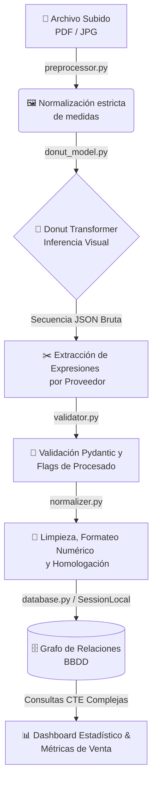

<div align="center">
  <h1>📊 Quantara</h1>
  <p><strong>API REST Avanzada de OCR y Business Intelligence para Albaranes</strong></p>
  
  <p>
    
    
    
    
    
    
  </p>
</div>

---

**Quantara** es una potente API REST diseñada para automatizar la extracción de información técnica y comercial a partir de facturas y albaranes digitales. Sustentada en modelos de visión Transformers de estado del arte (*Donut Model*), la plataforma procesa documentos, normaliza datos de interés y consolida una base de datos relacional para el cálculo transversal de márgenes, comparación de costes y control exhaustivo del gasto corporativo.

## ✨ Características Principales

* 👁️ **OCR Automatizado Libre de Tesseract**: Convierte al instante imágenes o PDFs en datos estructurados (Proveedor, fecha, base imponible y total) valiéndose únicamente del modelo *Transformer*.
* 🛒 **Desglose Inteligente de Líneas de Pedido**: Analiza resultados mediante expresiones regulares adaptativas por proveedor para extraer filas de productos unitarios, sus cantidades e importes.
* 📈 **Business Intelligence & Dashboarding**: Genera estadísticas agregativas en tiempo real vía endpoints. Evalúa los volúmenes de compra por entidad, identifica productos de alta demanda y compara el histórico de costes adquiridos entre diferentes proveedores.
* 🛡️ **Tolerancia a Fallos & Feedback (HITL)**: Los campos ilegibles o dudosos se interceptan y notifican dinámicamente. Integramos una capa *Human in the Loop* a través de endpoints de validación y _feedback_ permitiendo ajustar sesgos y retroalimentar datos sanos.
* 💰 **Análisis de Márgenes vs Ventas**: Fija tus precios de "carta" (PVP públicos) en la API para cruzarlos con el historial de compras local y descubrir la rentabilidad neta real de cada producto.

---

## 🛠️ Stack Tecnológico

| Área | Tecnologías Principales |
| :--- | :--- |
| **API & Backend** | `FastAPI`, `Uvicorn`, `python-multipart`, `Pydantic` |
| **Inteligencia Artificial**| `PyTorch` (`torch`), `Transformers` (*naver-clova-ix/donut-base*), `Pillow`, `MLflow` |
| **Datos y Persistencia** | `SQLAlchemy` (`psycopg2-binary` pre-equipado), motor local `SQLite` (*quantara.db*) |

---

## ⚙️ Arquitectura & Flujo de Datos (How it Works)

Quantara sigue un flujo de procesamiento unidireccional y robusto: transformar el caos de píxeles en analítica empresarial depurada y consultable.



---

## 📂 Estructura del Proyecto

```text
📦 Quantara
 ┣ 📜 main.py                # 🚀 Entry point (FastAPI y creación recursiva de la Base de Datos)
 ┣ 📂 data/                  # 💾 Almacenamiento local SQLite (quantara.db) y envíos temporales
 ┣ 📂 static/                # 🌐 Assets UI locales servidos en raíz (HTML/JS Frontend Dashboard)
 ┣ 📂 quantara/              # 🧠 Lógica Core del sistema
 ┃ ┣ 📜 config.py            # ⚙️ Constantes inyectables (Rutas DB, Config de Modelos, Resoluciones)
 ┃ ┣ 📜 requirements.txt     # 📦 Paquetería dependiente
 ┃ ┣ 📂 api/                 # 🛣️ Capa de Enrutamiento REST
 ┃ ┃ ┣ 📜 routes.py          # Definición Endpoint REST (/upload, /stats, /margen, /precio-venta...)
 ┃ ┃ ┗ 📜 schemas.py         # Interfaz y contratos de Entrada / Salida (Pydantic)
 ┃ ┣ 📂 core/                # 🛠️ Reglas estrictas de Negocio
 ┃ ┃ ┣ 📜 normalizer.py      # Homologación fonética y de Strings (Emparejamiento de Proveedores)
 ┃ ┃ ┗ 📜 validator.py       # Detección temprana de extracciones OCR inválidas o ausentes
 ┃ ┣ 📂 graph/               # 🗃️ Capa de Acceso a Datos / Envolventes SQL
 ┃ ┃ ┣ 📜 database.py        # Configuración Pool SQLAlchemy a SQLite
 ┃ ┃ ┣ 📜 models.py          # Entidades persistentes (Albaran, Proveedor, Producto, PrecioVenta...)
 ┃ ┃ ┗ 📜 queries.py         # Set de abstracciones transaccionales y agregadores métricos (`GROUP BY`s)
 ┃ ┗ 📂 ocr/                 # 👁️ Engine de Visión Artificial Documental
 ┃   ┣ 📜 donut_model.py     # Gestor de Modelos de HuggingFace sobre Donut Base y secuencias Regex
 ┃   ┗ 📜 preprocessor.py    # Adaptador para conversión Iterativa en array de PDFs a Imágenes
 ┗ 📜 fix_db.py / debug_*    # 🐛 Scripts locales para testing veloz en estado Dev.
```

---

## 🚀 Instalación y Despliegue

**1. Preparar el entorno virtual e instalar los requerimientos:**
```bash
# Recomendado el uso de un virtualenv (venv) configurado
pip install -r quantara/requirements.txt
```

**2. Iniciar el servidor de aplicaciones web (La DB se auto-generará si no existe):**
```bash
python quantara/main.py
```
> **Tip Experto**: Para modo programador, lánzalo nativamente con autocompilación: 
> `uvicorn quantara.main:app --host 0.0.0.0 --port 8000 --reload`

---

## 🔧 Configuración / Variables de Entorno

Definidas precompiladas sobre el entorno base dentro de `quantara/config.py`:

| Variable interna | Propósito Estratégico | Valor de Arranque |
| :--- | :--- | :--- |
| `BASE_DIR` | Identifica la topología de la raíz del sistema de manera relativa. | `os.path.dirname(os.path.abspath(__file__))` |
| `DB_PATH` | Especifica la ubicación del volcado relacional SQLite principal. | `data/quantara.db` |
| `UPLOAD_DIR` | Directorio con recolección de archivos y subidas efímeras | `data/albaranes` |
| `MODEL_NAME` | Referencia remota del transformador utilizado en predicciones HF | `naver-clova-ix/donut-base` |
| `MAX_IMAGE_SIZE` | Rescalado predeterminado exigido previo a entrar en red neuronal | `(1280, 960)` |

---

## 🔌 API Endpoints
*Nota: Todos los puntos de integración REST son expuestos bajo el prefijo universal `/api/v1`*

### 📥 Ingestión de Documentos y Corrección (OCR)
| Method | Endpoint | Resumen Operativo | Data Body Requerida (JSON/Form) |
|:---:|:---|:---|:---|
| 🟣 **POST** | `/upload` | Renderiza un albarán pasándolo por Transformación OCR. Persiste cabeceras y productos en DB. | FormData: `file` (*UploadFile PDF/JPG*) |
| 🟣 **POST** | `/feedback`| Registrar retroalimentación humana correctiva por métricas no descifradas al modelo. | JSON: `{"albaran_id": 1, "campo": "total", "valor_ocr": "X", "valor_correcto": "Y"}` |

### 📊 Endpoints Analíticos, Grafo y Dashboard
| Method | Endpoint | Resumen Operativo / Meta del Agregado |
|:---:|:---|:---|
| 🟢 **GET** | `/albaranes` | Paginación global de los documentos integrados en el tiempo. *(Queries: `proveedor`, `fecha_x`, `skip`, `limit`)* |
| 🟢 **GET** | `/albaran/{id}` | Recupera al detalle la topología de un albarán junto a los bienes derivados dentro del mismo. |
| 🟢 **GET** | `/stats` | Macro-Dashboarding: Gasto aglomerado histórico y un ranking de las familias de artículos pre-minados en volumen. |
| 🟢 **GET** | `/resumen` | Fotografía matemática circunscrita al inicio y fin del transcurso del mes laboral actual. |
| 🟢 **GET** | `/gasto-proveedores`| Agrupación de facturación monetaria segmentada por proveedor finalizado. *(Queries ISO: `desde`, `hasta`)* |
| 🟢 **GET** | `/producto/{nombre}/coste` | Histograma trazado en el tiempo evaluando las fluctuaciones del precio de compra. |
| 🟢 **GET** | `/producto/{nombre}/comparar` | Cruce entre diferentes bases (Proveedores) que ofrecen acceso paralelo al mismísimo nombre de producto para optimización. |
| 🟢 **GET** | `/margen/{producto}` | Realiza un escaneo final interrelacionando medias de adquisición vs el `PrecioVenta` declarado. |
| 🟣 **POST** | `/precio-venta` | Inserta o machaca un valor base general al público para dotar a Quantara de variables sobre las cuales calcular métricas/rentabilidad. (`descripcion`, `precio_venta`, `unidad` ) |

---

## 💻 Ejemplos de Interacción (Usage Examples)

**📡 Escanear e Ingestar un documento por terminal (Comando CURL)**
```bash
curl -X POST "http://127.0.0.1:8000/api/v1/upload" \
  -H "accept: application/json" \
  -H "Content-Type: multipart/form-data" \
  -F "file=@mi_albaran_distribuidor.pdf;type=application/pdf"
```

**🗣️ Emitir corrección humana interactiva frente al modelo (Petición Feedback)**
```bash
curl -X POST "http://127.0.0.1:8000/api/v1/feedback" \
  -H "Content-Type: application/json" \
  -d '{
      "albaran_id": 16, 
      "campo": "total", 
      "valor_ocr": "15,0h", 
      "valor_correcto": "15.06"
      }'
```

**💸 Inyectar precio de carta al público para cruce de márgenes rentables**
```bash
curl -X POST "http://127.0.0.1:8000/api/v1/precio-venta" \
  -H "Content-Type: application/json" \
  -d '{
      "descripcion": "Refresco Cola 33cl", 
      "precio_venta": 2.50, 
      "unidad": "ud"
      }'
```
